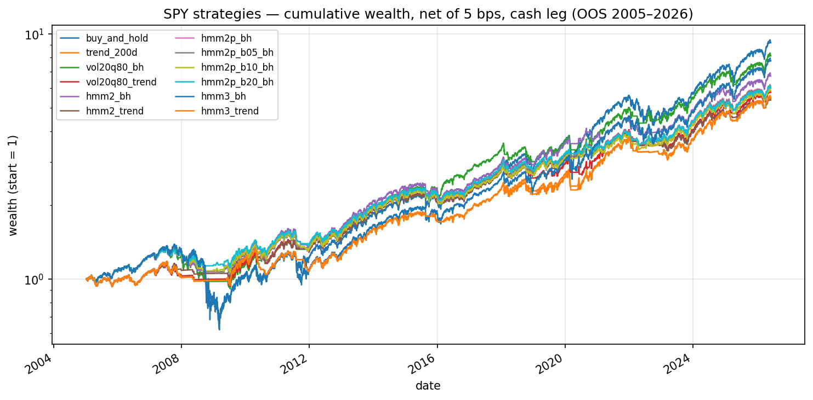
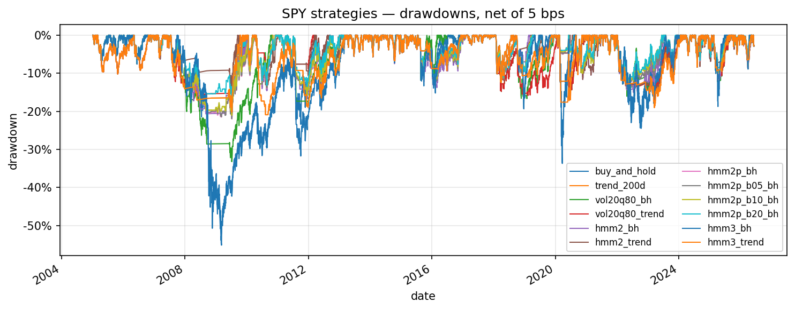
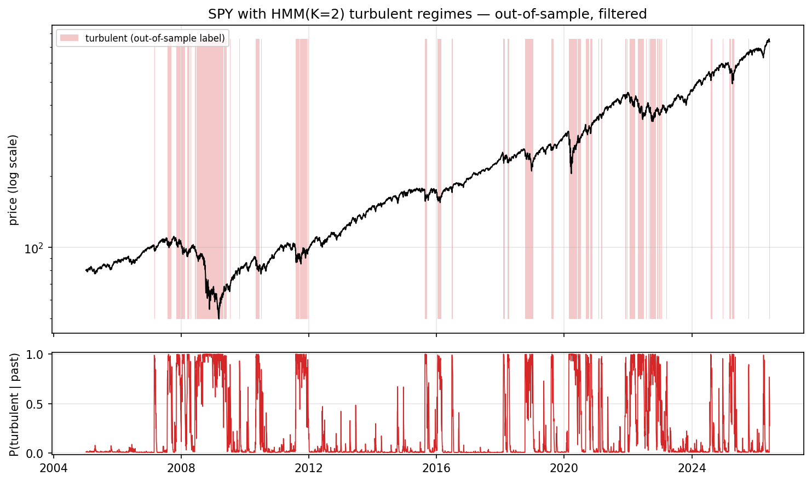
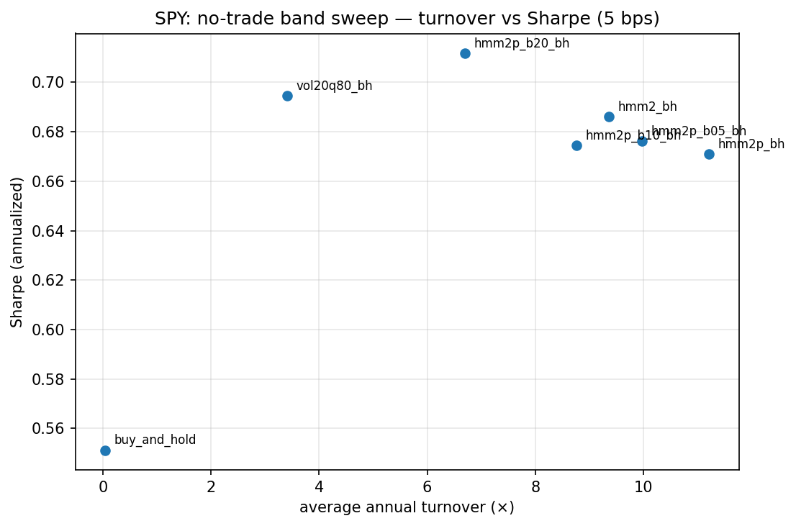
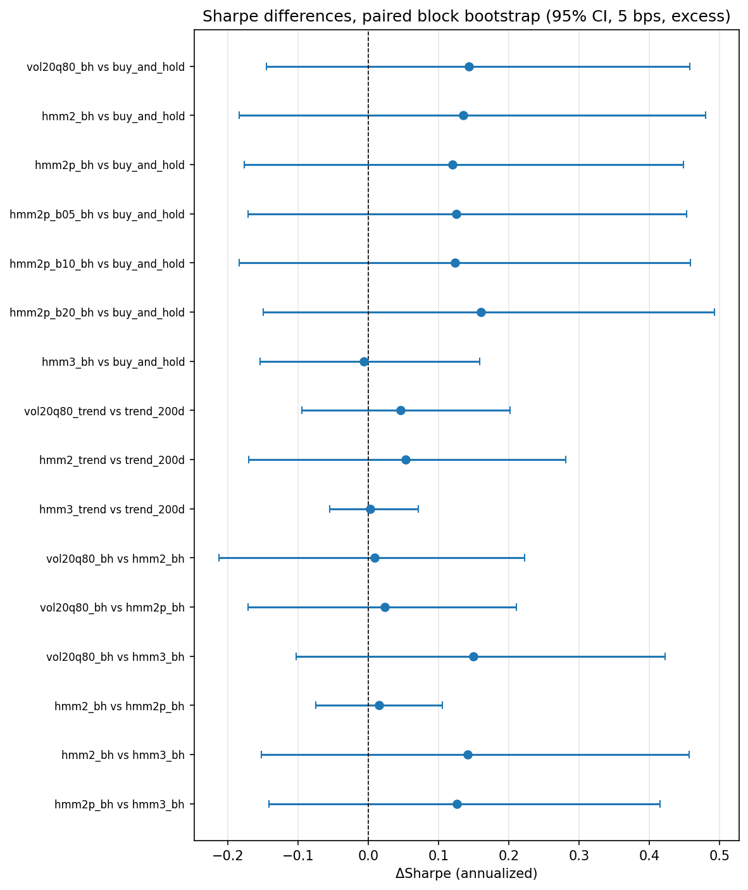
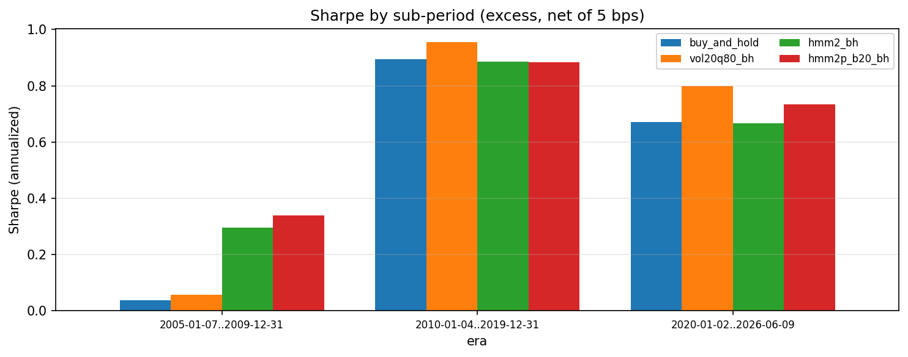
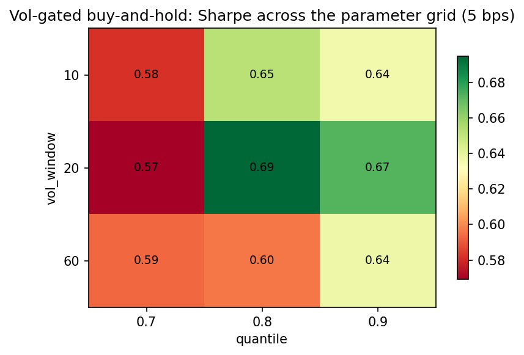
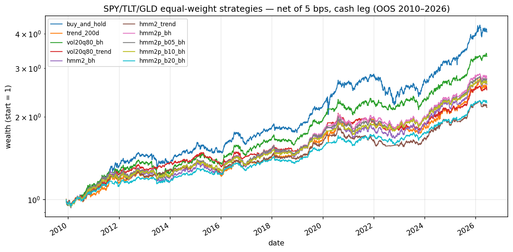
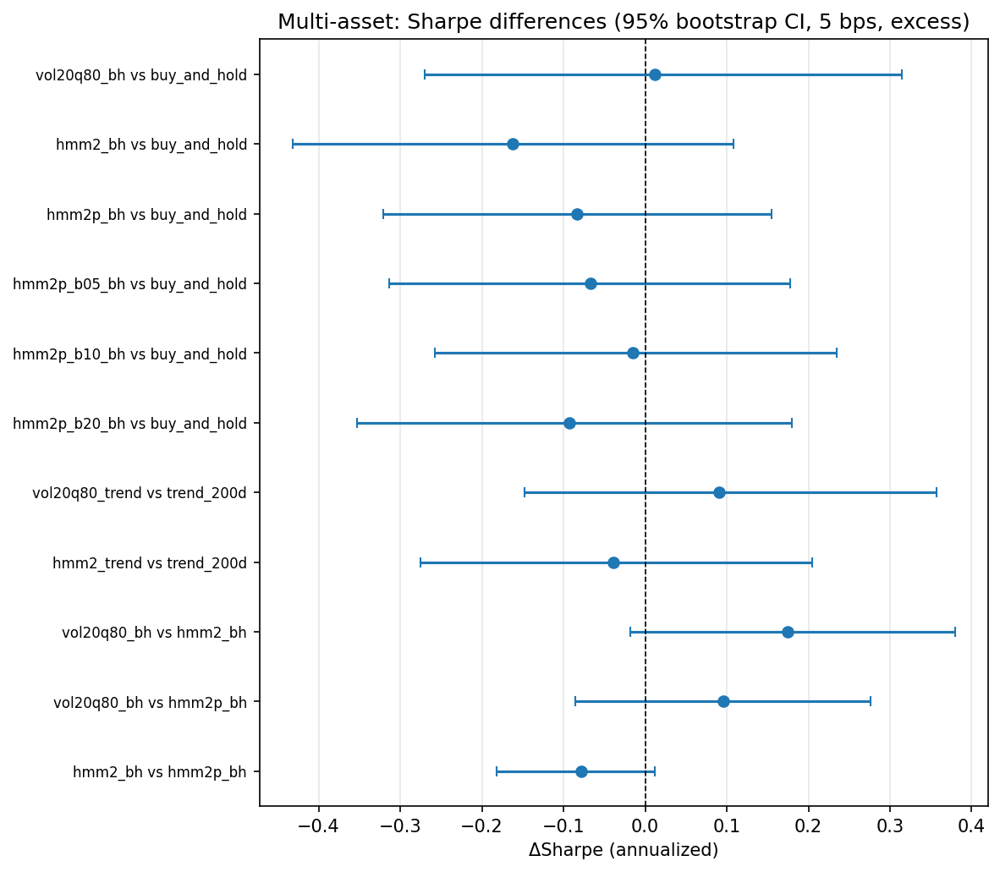
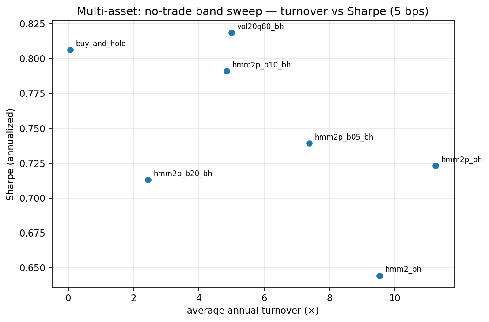

# Does regime detection make simple strategies more robust?

**RegimeLab research report — June 2026 (v3: cash leg, no-trade bands,
nuisance-parameter sensitivity).**
All results are out-of-sample, net of transaction costs, and reproducible via
the commands in the appendix. Figures are generated by the notebooks in
`notebooks/` from experiment outputs only.

## Summary

On the S&P 500 ETF (SPY, 2005–2026, walk-forward validation, 5 bps costs, flat
weight earning the lagged T-bill rate), gating buy-and-hold with a volatility
filter or a 2-state Gaussian HMM raised the excess-return Sharpe from 0.55 to
≈0.69 and cut the maximum drawdown from −55% to −33%/−21%. As in v2, **no
Sharpe difference is statistically distinguishable from zero at 95%**, the
Sharpe edge concentrates in crisis eras while the drawdown reduction is
consistent everywhere, and the diversified SPY/TLT/GLD portfolio remains
unbeaten by any gate. The v3 additions sharpen two points: (i) the cash leg
lifts gated absolute returns (flat days earned ~1.9%/yr on average) but does
not change any inferential conclusion; (ii) a **no-trade band on
probability-scaled exposure fixes the HMM's turnover problem** — multi-asset,
it takes the HMM family from clearly-worse (Sharpe 0.64 at 9.5×/yr turnover)
to nearly matching buy-and-hold at a fraction of the risk (Sharpe 0.79, max
drawdown −10% vs. −23%, 4.9×/yr). Conclusions are stable across bootstrap
block lengths and walk-forward schedules.

## 1. Research question

Can market regime detection improve the *robustness* — not the headline
performance — of simple strategies, out-of-sample and after costs? Does a
statistical regime model earn its complexity over a transparent heuristic?
Does the answer survive diversification, and can the cost side of regime
trading be fixed mechanically?

## 2. Data and protocol

- **Data.** Adjusted closes from yfinance, cached immutably with download
  metadata. Single-asset: SPY 2000–2026. Multi-asset: SPY/TLT/GLD from
  2004-12. Cash rate: 13-week T-bill yield (`^IRX`), converted to a daily
  simple return and **lagged one day** (the rate known at *t* accrues over
  *t+1*); bond-market holidays carry the prior quote.
- **Validation.** Expanding walk-forward: 1,260-day initial train, refit every
  252 days (SPY: 22 refits, OOS 2005-01→2026-06; multi-asset: 17 refits, OOS
  2009-12→2026-06). Models fitted per asset, on past data only.
- **Point-in-time safety.** Execution lag centralized in the engine; HMM
  inference uses *filtered* probabilities from a manual forward recursion;
  features, labels, probabilities, and the banded recursion pass truncation
  causality tests. The no-trade band is forward-only by construction.
- **Costs.** Proportional, 5 bps headline, swept over {0, 5, 20}. Sharpe and
  Sortino are computed on returns in excess of the T-bill rate.

## 3. Models and strategies

| Name | Description |
|---|---|
| `buy_and_hold` | Fully invested (equal-weight across assets) |
| `trend_200d` | Long when price > 200-day MA, else cash (per asset) |
| `vol20q80_*` | Flat when 20d realized vol > 80% quantile of training vol |
| `hmm2_*` | Flat when the 2-state HMM's filtered state is high-variance |
| `hmm2p_bh` | Continuous: exposure = filtered P(calm), per asset |
| `hmm2p_bXX_bh` | Same, with a no-trade band δ = XX/100: hold the current weight until the target moves further than δ |
| `hmm3_bh` | Flat only in the most turbulent of 3 HMM states |

## 4. Single-asset results (SPY, out-of-sample, 5 bps, excess Sharpe)





| Strategy | Sharpe | Ann. return | Max DD | Turnover/yr |
|---|---|---|---|---|
| buy_and_hold | 0.55 | 10.9% | −55% | 0.05× |
| trend_200d | 0.60 | 8.3% | −21% | 6.3× |
| vol20q80_bh | 0.70 | 10.3% | −33% | 3.4× |
| hmm2_bh | 0.69 | 9.3% | −21% | 9.4× |
| hmm2p_bh | 0.67 | 8.8% | −22% | 11.2× |
| hmm2p_b20_bh | 0.71 | 8.8% | −17% | 6.7× |
| hmm3_bh | 0.55 | 10.1% | −52% | 4.1× |

The cash leg raises gated annualized returns by ~0.2–0.3 pp versus v2 (and
trend-following by ~0.3 pp — it is flat ~30% of days). Rankings are unchanged.

### 4.1 What the HMM actually detects



Turbulent labels (21% of OOS days) concentrate on 2008–09, 2011, 2015–16,
2018, March 2020, and 2022. Near regime boundaries the filtered probability
oscillates around 0.5 — the flicker that drives the hard gate's 9.4×/yr
turnover, and the target of the no-trade band.

### 4.2 Banding the flicker



The band sweep (δ ∈ {0.05, 0.10, 0.20}) cuts turnover monotonically
(11.2× → 10.0× → 8.8× → 6.7×) at no Sharpe cost — the widest band has the
HMM family's best Sharpe (0.71) and best drawdown (−17%). Read as a sweep,
not a tuned point: the lesson is that the scaled strategy's Sharpe is flat in
δ while its costs are not, so banding is (weakly) dominant.

### 4.3 Inference, eras, parameters, and nuisance choices



Every 95% interval on a Sharpe difference includes zero (vol gate vs.
buy-and-hold: +0.14, CI [−0.15, +0.46], P(≤0) = 0.19). The cash leg does not
change the inferential picture.



The Sharpe edge lives in 2005–09 and 2020+; the drawdown reduction appears in
every era — the crash-insurance interpretation survives v3 unchanged.



The vol-gate grid remains a plateau (all cells ≥ 0.57 vs. buy-and-hold's
0.55). **Nuisance checks (new):** bootstrap P(≤0) values move by < 0.03
across block lengths {5, 21, 63}, and the vol gate's Sharpe stays within
0.70–0.78 across {expanding, rolling} × {126, 252}-day refits. No conclusion
hinges on these constants.

## 5. Multi-asset results (SPY/TLT/GLD, equal-weight, 2010–2026, 5 bps)



| Strategy | Sharpe | Ann. return | Max DD | Turnover/yr |
|---|---|---|---|---|
| vol20q80_bh | 0.82 | 7.5% | −13% | 5.0× |
| buy_and_hold (EW) | 0.81 | 8.9% | −23% | 0.06× |
| **hmm2p_b10_bh** | **0.79** | 6.1% | **−10%** | 4.9× |
| hmm2p_b05_bh | 0.74 | 6.2% | −12% | 7.4× |
| hmm2p_bh (soft) | 0.72 | 6.3% | −12% | 11.3× |
| hmm2p_b20_bh | 0.71 | 5.0% | −8% | 2.4× |
| hmm2_bh (hard) | 0.64 | 6.0% | −15% | 9.5× |





The v2 conclusion stands: nothing beats diversified buy-and-hold with any
confidence (vol gate +0.01, P(≤0) = 0.46; hard HMM −0.16, P = 0.87; soft
beats hard with P(hard ≥ soft) = 0.045). The new result is what banding does
to the frontier: δ = 0.10 nearly matches buy-and-hold's Sharpe (0.79 vs.
0.81) while halving the max drawdown (−10% vs. −23%); δ = 0.20 cuts it to
−8% on 2.4×/yr turnover. Regime detection still does not *add* risk-adjusted
return to a diversified portfolio — but banding makes the insurance it
provides much cheaper.

## 6. Conclusions

1. **Regime gating is crash insurance** — in every configuration tested it
   cuts deep drawdowns at some return cost, and its Sharpe "improvements"
   never clear bootstrap scrutiny.
2. **Complexity still did not pay** — the volatility heuristic remains at
   least the HMM's equal on SPY and clearly better multi-asset
   (P(≤0) = 0.04 for vol-vs-hard-HMM).
3. **Diversification first** — unchanged from v2, and now established with a
   proper cash leg, so it is not an artifact of uncompensated cash.
4. **If using a probabilistic model: scale, band, don't threshold.** The
   ordering hard < soft < banded-soft holds in both universes; banding fixes
   the cost fragility that made the HMM strictly worse at 20 bps in v2.
5. **The findings are not nuisance-parameter artifacts** — stable across
   bootstrap block lengths and walk-forward schedules.

## 7. Limitations

- Cash conversion uses the discount-yield approximation (y/100/252); error is
  negligible at historical yields but documented rather than eliminated.
- Band levels were swept, not optimized — but the *set* of levels was still
  chosen by us; a pre-registered grid would be cleaner.
- Multi-asset gating remains per-asset; a joint multivariate HMM is the open
  hypothesis (next iteration).
- yfinance data; one and a half market cycles for the multi-asset sample.
- With ~12 strategy variants, multiple-comparison effects deserve a formal
  treatment (deflated Sharpe) once the strategy set stops growing.

## 8. Next improvements

1. Joint multivariate HMM on the SPY/TLT/GLD return vector vs. the per-asset
   models — does cross-asset structure rescue the statistical approach?
2. Deflated Sharpe / multiple-comparison appendix.
3. Block-bootstrap on drawdown-based metrics (the quantity regime gating
   actually improves).

## Appendix: reproducibility

```bash
pip install -e ".[models,data,notebooks,dev]"
pytest                                                            # 102 tests
python experiments/run_regime_comparison.py configs/comparison_spy.yaml
python experiments/run_robustness.py       configs/comparison_spy.yaml
python experiments/run_regime_comparison.py configs/multiasset.yaml
python experiments/run_robustness.py       configs/multiasset.yaml
PYTHONPATH=src jupyter nbconvert --to notebook --execute --inplace notebooks/0*.ipynb
```

Outputs land in `experiments/outputs/<name>/`; figures in `reports/figures/`;
methodological decisions and rationale in `reports/decisions.md`.
